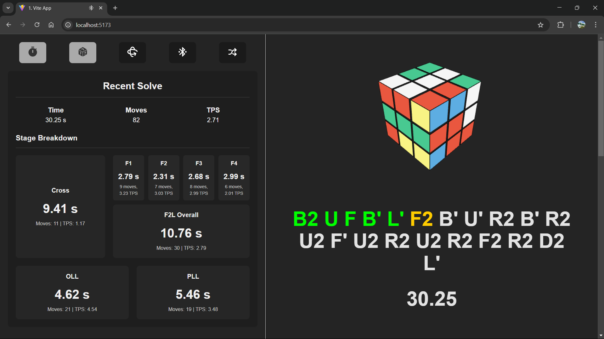

# Bluetooth Cube Timer

A personal project to revolutionize your Rubik's Cube practice! This app connects to your Bluetooth-enabled cube, detects your solving phase (Cross, F2L, OLL, PLL), automatically times your solves, generates scrambles, logs your results, and even calculates your turns per second.

## Screenshots


*An example screenshot of the app interface.*

## Features

- **Bluetooth Connectivity:** Seamlessly connect with your Bluetooth cube.
- **Phase Detection:** Automatically identifies which phase you’re in (Cross, F2L, OLL, PLL).
- **Automatic Timing:** Starts and stops the timer based on your solve.
- **Scramble Generation:** Generates random scrambles for a varied solving experience.
- **Solve Logging:** Saves all your solve times for future reference.
- **Performance Metrics:** Displays your average turns per second to help you track improvement.

## Installation

1. **Clone the Repository:**
2. **Navigate to the Project Directory:**
3. **Install Dependencies:**
```bash
npm install
```
4. **Run the Application:**
```bash
npm run dev
```

## Setup

1. **Bluetooth Setup:**
   - Ensure your Bluetooth cube is powered on and in pairing mode.
   - Open the app and navigate to the settings menu to pair your cube.
2. **Application Configuration:**
   - Update configuration files if needed (e.g., for API keys or Bluetooth settings).
   - Follow any additional instructions in the documentation within the repository.

## Usage

1. **Starting a Solve:**
   - Press the “Start” button to begin a new solve.
   - The timer will automatically start and detect the solve phases.
2. **During the Solve:**
   - The app monitors your progress through the Cross, F2L, OLL, and PLL phases.
   - Your turns per second are calculated in real time.
3. **After the Solve:**
   - Your solve time, scramble, and performance metrics are logged and can be reviewed later.
   - Access your solve history through the “History” section of the app.

## Contributing

Contributions are welcome! If you have suggestions or improvements:
- Please open an issue to discuss your ideas.
- Submit a pull request with your proposed changes.

## License

This project is licensed under the [MIT License](LICENSE).

## Contact

For any questions or support, feel free to reach out at [vssarathc04@gmail.com](mailto:vssarathc04@gmail.com).

Happy cubing!

NOTE: This readme is generated by chatgpt :);